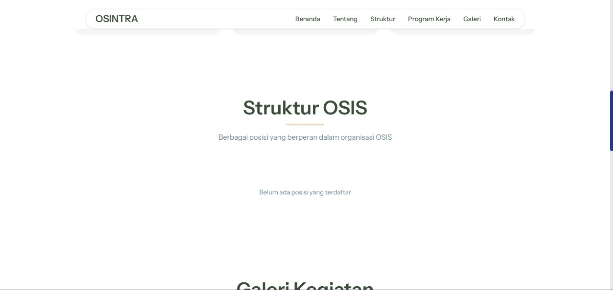
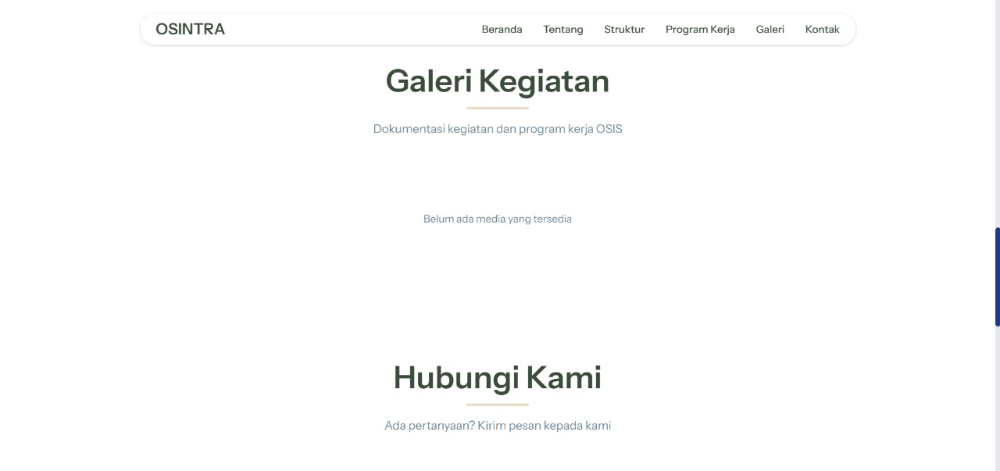
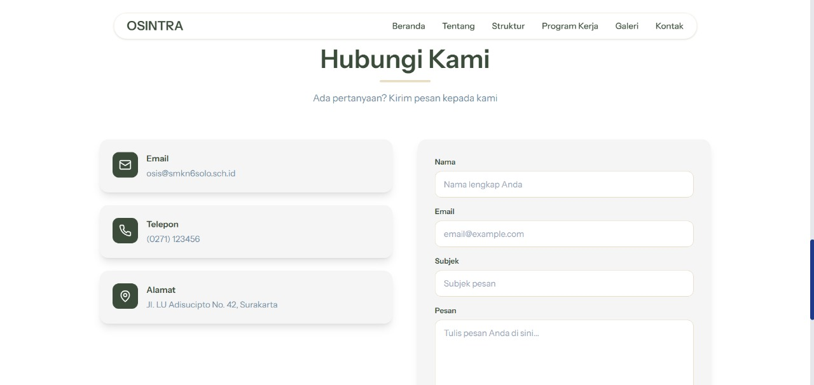
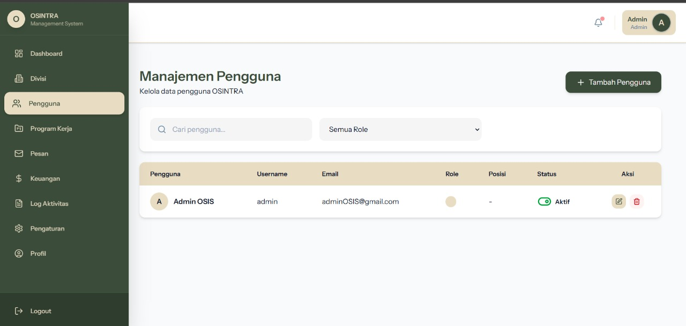
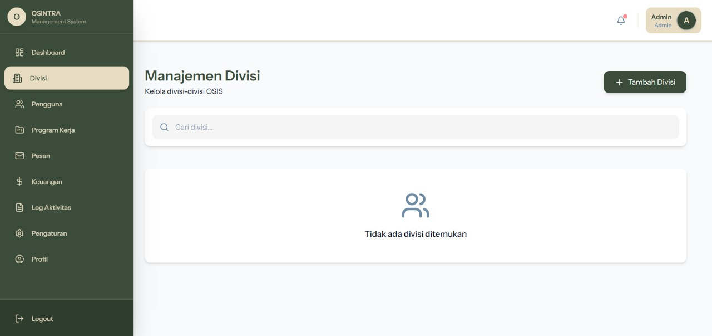
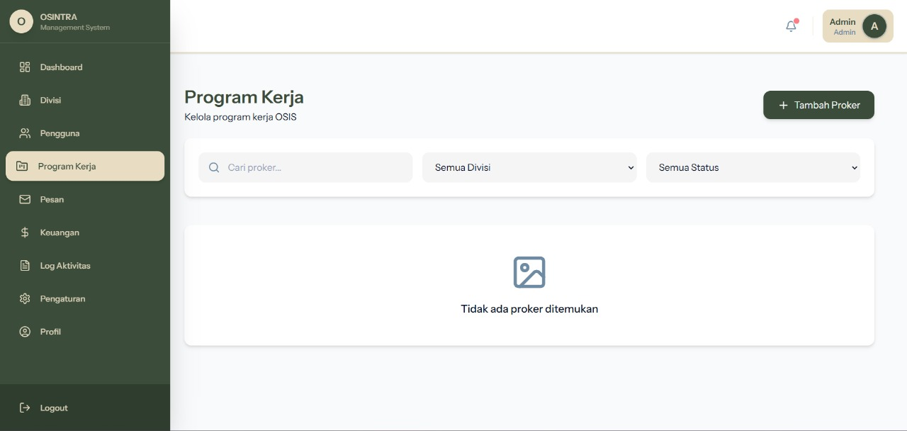
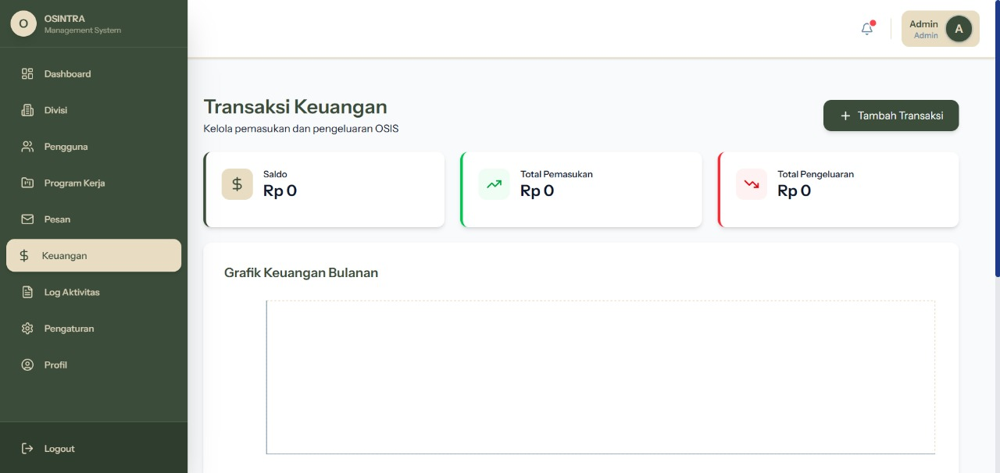
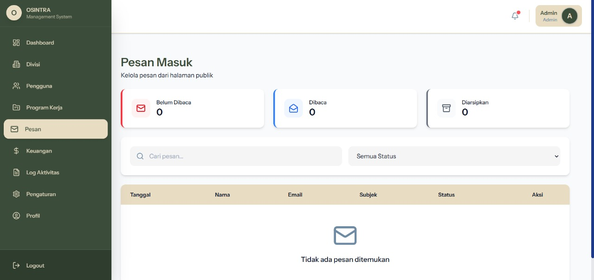
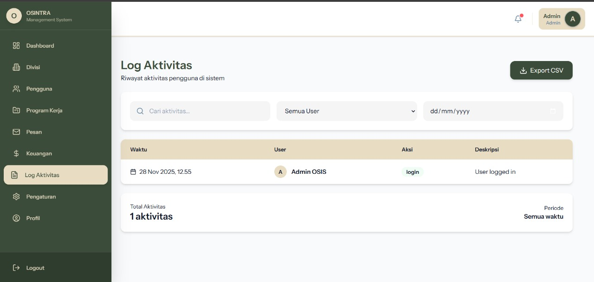

# OSINTRA  
### OSIS Integrated Administration

OSINTRA adalah sistem manajemen organisasi berbasis web yang dirancang untuk mendigitalisasi seluruh aktivitas OSIS, mulai dari manajemen anggota, program kerja, jabatan, divisi, transaksi keuangan, hingga audit aktivitas pengguna.  
Proyek ini dibangun menggunakan **Laravel**, **Vite**, dan **React + TypeScript**.

---

## 🚀 Tujuan Pengembangan
Menyediakan platform terpusat yang memudahkan OSIS dalam:
- Mengatur struktur organisasi.
- Mengelola program kerja secara rapi dan terdokumentasi.
- Melakukan pencatatan keuangan yang transparan.
- Mendokumentasikan kegiatan OSIS.
- Menyediakan halaman publik informatif untuk siswa dan guru.

---

## 🧩 Fitur Utama

### 1. Manajemen Pengguna
- Data lengkap pengguna OSIS, pembina, guru, dan admin.
- Integrasi role + permission.
- Dukungan foto profil dan status akun.

### 2. Divisi & Jabatan
- Tabel **divisions** untuk seksi bidang OSIS.
- Tabel **positions** untuk jabatan formal (Ketua, Wakil, Sekretaris, dsb).
- Relasi penuh ke users & proker.

### 3. Program Kerja (PROKER)
- CRUD program kerja.
- Penentuan divisi penanggung jawab.
- Dokumentasi melalui **proker_media** (foto/video).
- Pembagian anggota tugas melalui **proker_anggota**.

### 4. Keuangan OSIS
- Pemasukan & pengeluaran dalam tabel **transactions**.
- Statistik ringkas pada dashboard.

### 5. Pesan Publik
- Form contact untuk siswa/guru.
- Pesan tersimpan di tabel **messages**.

### 6. Audit Log
- Tracking semua aktivitas penting: login, update data, perubahan proker, transaksi, dan lainnya.

### 7. Pengaturan Aplikasi
- Tersimpan di **app_settings** untuk mengatur nama sekolah, tema, logo, dll.

---

## 🎨 Tema Warna yang Digunakan
Tema warna disesuaikan dengan referensi visual seragam PDH OSIS:

| Elemen | Warna | Deskripsi |
|--------|--------|------------|
| Primary | `#E8DCC3` | Cream lembut (PDH OSIS) |
| Accent | `#3B4D3A` | Hijau tua list PDH |
| Text | `#1E1E1E` | Warna teks utama |
| Background | `#F5F5F5` | Background bersih dan modern |

---

## 🗂️ Struktur Database (22 Table)

Struktur OSINTRA terdiri dari tabel utama & tabel pendukung Laravel:

**Tabel Utama:**
- users  
- roles  
- role_permissions  
- divisions  
- positions  
- prokers  
- proker_anggota  
- proker_media  
- proker_division  
- messages  
- transactions  
- audit_logs  
- app_settings  

**Tabel Sistem (Laravel default):**
- sessions  
- cache  
- cache_locks  
- jobs  
- failed_jobs  
- job_batches  
- password_reset_tokens  
- personal_access_tokens  
- migrations  

---

## 🧱 Struktur Halaman Publik

### 1. Homepage
- Informasi OSIS  
- Highlight proker terbaru  
- Showcase nilai & visi organisasi  

### 2. Divisions Page
- Penjelasan divisi  
- Struktur anggota setiap divisi  

### 3. Programs / Proker Page
- Semua program kerja  
- Filter berdasarkan divisi atau status  

### 4. Gallery Page
- Foto & video dokumentasi kegiatan OSIS  

### 5. Contact Page
- Form kirim pesan  
- Terhubung ke tabel `messages`  

---

## 🖥️ Teknologi yang Digunakan

| Layer | Teknologi |
|------|-----------|
| Backend | Laravel 12.x |
| Frontend | React + TypeScript + Tailwind |
| Builder | Vite |
| Database | MySQL |
| Authentication | Laravel Auth / Session |
| UI | Custom Theme (Cream–Green–Blue) |

---
## Dokumentasi Aplikasi

### 1. Halaman Publik (Public Page)

#### 1.1 Beranda (Homepage)
Menampilkan profil OSIS, visi–misi, highlight kegiatan, dan navigasi utama.

#### 1.2 Divisi OSIS
Daftar lengkap divisi, penjelasan tugas, dan struktur anggotanya.

#### 1.3 Galeri Kegiatan
Foto & video dokumentasi kegiatan OSIS yang diambil dari tabel `proker_media`.

#### 1.4 Contact Page
Form untuk pengunjung mengirim pesan ke OSIS (tersimpan ke tabel `messages`).

---

### 2. Dashboard Internal (Private / Authenticated Area)

#### 2.1 Dashboard Utama
Menampilkan ringkasan statistik:
- Jumlah anggota OSIS  
- Jumlah divisi  
- Total proker  
- Saldo keuangan  
- Log aktivitas terbaru  

#### 2.2 Manajemen Pengguna (Users)
CRUD anggota OSIS, pembina, admin, serta pengaturan role/permission.

#### 2.3 Divisi OSIS (Divisions)
CRUD divisi OSIS dan melihat daftar anggota tiap divisi.

#### 2.4 Jabatan (Positions)
Pengelolaan struktur jabatan OSIS seperti Ketua, Wakil, Sekretaris, Bendahara, dan lainnya.

#### 2.5 Program Kerja (Prokers)
CRUD proker berikut detailnya:
- Informasi proker  
- Anggota pelaksana  
- Galeri kegiatan  

#### 2.6 Manajemen Keuangan (Transactions)
Pencatatan pemasukan/pengeluaran OSIS serta laporan saldo.

#### 2.7 Pesan Pengunjung (Messages)
Daftar pesan dari halaman publik dengan status unread, read, dan archived.

#### 2.8 Audit Log
Mencatat aktivitas penting pengguna untuk keamanan sistem.

#### 2.9 App Settings
Pengaturan global aplikasi:
- Nama sekolah  
- Logo  
- Tema warna  
- Preferensi tampilan  
!Masih dalam taham pengembangan!

####  **Status Pengembangan**
OSINTRA masih dalam tahap pengembangan aktif, dengan fokus pada:

- Penyempurnaan dashboard internal
- Integrasi penuh role & permission
- Penyempurnaan desain UI halaman publik
- Dokumentasi dan pengujian

Dibuat oleh Roodiext dengan kolaborasi bersama ClaveoraDev.

